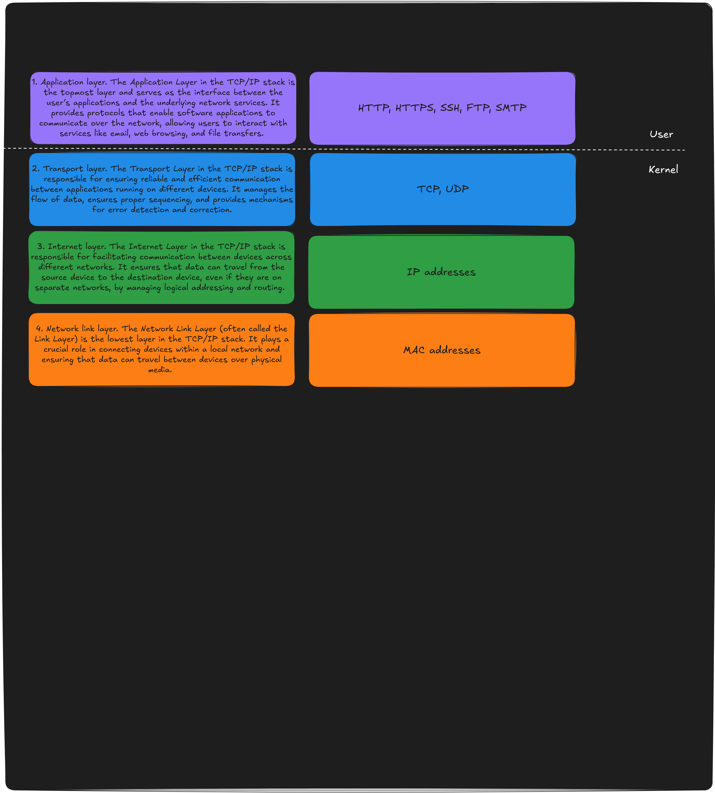

TCP/IP stands for Transmission Control Protocol/Internet Protocol, and it is a 
group of communication protocols that allow devices to connect and communicate 
over the internet.

Among the protocols in this suite, TCP and IP are the most essential, though 
several others also play a role. The TCP/IP suite acts as a middle layer that 
bridges internet applications with the network’s underlying infrastructure, 
which handles routing and switching.

TCP/IP defines how data is sent across the internet by enabling end-to-end 
communication. It outlines how data should be divided into packets, assigned 
addresses, sent, directed through the network, and reassembled at the receiving 
end. It operates with minimal centralized control, ensuring networks remain 
reliable and can recover automatically if a device in the network fails.

Currently, the internet primarily uses Internet Protocol Version 4 (IPv4). 
However, because IPv4 has a limited number of unique addresses, a newer 
protocol, IPv6. IPv6 greatly increases the number of available addresses and is 
being gradually adopted to meet growing demands.

## How does TCP/IP work?

he TCP/IP stack operates based on a layered architecture, facilitating 
communication between devices over a network.

### Client-Server Communication

TCP/IP follows a client-server model, where a client (a user or device) requests 
a service, such as accessing a webpage, from a server (a computer in the network). 
The server processes the request and sends back the desired data. For example, 
when you open a browser and visit a website, your device acts as the client, 
and the website's hosting server responds to your request.

### Stateless Protocol Suite

The TCP/IP suite is considered stateless, meaning that each client request is 
treated as independent and not linked to previous interactions. This stateless 
nature makes the network more efficient because it doesn't need to store 
information about prior requests, freeing up resources and network paths for 
continuous use.

### Stateful Transport Layer

While the TCP/IP protocol suite is stateless, the transport layer, specifically 
the Transmission Control Protocol (TCP), is stateful. When a message is 
transmitted, TCP ensures that all packets belonging to the message are sent, 
received, and reassembled in the correct order. The connection between the 
sender and receiver remains active until the entire message has been 
successfully delivered.

## TCP/IP stack layers

We have four layers in the TCP/IP stack.

### Application Layer

The Application Layer is the bridge between the user and the network. By 
providing specific protocols and services, it enables seamless communication 
between applications over a network, whether it's browsing the web, sending 
emails, or downloading files.

1. User Interaction:
- This layer directly interacts with user applications, enabling data exchange 
between the network and the application software.
2. Protocol-Specific Communication:
- It provides a set of protocols that define how specific types of data are 
formatted, transmitted, and interpreted by applications. For example, HTTP for 
web browsing and SMTP for email.
3. Data Formatting and Translation:
- It ensures that the data from applications is formatted properly for 
transmission over the network and interprets incoming data for applications to 
use.
4. Authentication and Encryption:
- Some protocols at this layer provide security features such as authentication 
of users and encryption of data to ensure safe communication.

#### Key Protocols of the Application Layer
1. HTTP (Hypertext Transfer Protocol):
- Used for accessing and transferring web pages over the internet.
- Secure version: HTTPS adds encryption using TLS/SSL.
2. FTP (File Transfer Protocol):
- Used for transferring files between devices on a network.
3. SMTP (Simple Mail Transfer Protocol):
- Handles sending of emails.
- Often used alongside POP3 or IMAP for retrieving emails.
4. DNS (Domain Name System):
- Translates human-readable domain names (e.g., www.example.com) into IP 
addresses.
5. Telnet and SSH:
- Telnet: Provides text-based remote access to another computer.
- SSH (Secure Shell): A secure alternative to Telnet for remote access.
6. SNMP (Simple Network Management Protocol):
- Used for managing devices on a network, such as routers and switches.

#### Role in the TCP/IP Stack
- The Application Layer sits above the Transport Layer.
- It uses the underlying services provided by the Transport Layer (e.g., TCP or 
UDP) to transmit data across the network.
- The layer enables applications to utilize the network without needing to 
worry about the details of data transmission.

### Transport Layer

The Transport Layer is critical for enabling smooth communication between 
applications on different devices. By providing reliability, flow control, and 
error handling, it ensures that data reaches its destination accurately and 
efficiently.

1. Data Segmentation and Reassembly:
- The Transport Layer divides large chunks of data from the Application Layer 
into smaller segments for transmission.
- At the destination, it reassembles these segments into the original data 
stream.
2. End-to-End Communication:
- It establishes a connection between the source and destination devices to 
ensure that data is delivered accurately.
- This connection can be connection-oriented (e.g., TCP) or connectionless 
(e.g., UDP).
3. Reliability:
- Acknowledgments (ACKs): Confirms the successful receipt of data.
- Retransmission: Resends lost or corrupted data packets.
- Flow Control: Prevents overwhelming the receiver by regulating the data 
transfer rate.
4. Multiplexing and Demultiplexing:
- Enables multiple applications on a single device to communicate 
simultaneously by using port numbers. For example, port 80 is used for HTTP and 
port 443 for HTTPS.
5. Error Detection and Recovery:
- Detects errors in transmitted data and ensures corrections are made, either 
by retransmission or through built-in error-checking mechanisms.

#### Key Protocols of the Transport Layer

1. TCP (Transmission Control Protocol):
- Connection-oriented: Establishes a virtual connection between sender and 
receiver.
- Ensures reliable delivery by providing error correction, acknowledgments, and 
data sequencing.
- Suitable for applications requiring high reliability, such as file transfers, 
emails, and web browsing.
2. UDP (User Datagram Protocol):
- Connectionless: Sends data without establishing a connection.
- Does not guarantee delivery, making it faster but less reliable.
- Used in applications where speed is more critical than reliability, such as 
live streaming, gaming, and DNS lookups.

#### Role in the TCP/IP Stack
- The Transport Layer operates between the Application Layer (above) and the 
Internet Layer (below).
- It takes data from applications, segments it, and sends it to the Internet 
Layer for addressing and routing.
- On receiving data, it reassembles segments into the original message and 
delivers it to the correct application.

### Internet Layer

The Internet Layer is the backbone of inter-network communication, enabling 
devices in separate networks to exchange data seamlessly through  logical 
addressing and routing.

1. Logical Addressing:
The Internet Layer uses IP (Internet Protocol) addresses to identify devices 
uniquely across the network. Unlike MAC addresses used in the Link Layer, IP 
addresses are logical and can change depending on the network.
2. Routing:
This layer determines the best path for data to travel between the source and 
destination, often passing through multiple intermediate devices like routers. 
Routing ensures that data packets move efficiently across interconnected 
networks.
3. Packet Fragmentation and Reassembly:
Large packets that exceed the maximum transmission unit (MTU) of a network may 
be fragmented into smaller pieces. The Internet Layer handles fragmentation and 
ensures that these fragments are correctly reassembled at the destination.
4. Encapsulation and Decapsulation:
    - When data arrives from the Transport Layer, the Internet Layer 
    encapsulates it into packets by adding an IP header.
    - At the destination, it decapsulates the packet, removing the IP header 
    before passing the data to the Transport Layer.
5. Error Handling:
The Internet Layer detects issues like unreachable destinations or routing 
loops and communicates these errors using protocols like ICMP (Internet Control 
Message Protocol).

#### Key Protocols of the Internet Layer
1. Internet Protocol (IP):
    - IPv4: The widely used version of IP, supporting 32-bit addressing.
    - IPv6: The newer version, with 128-bit addressing to accommodate a vastly 
    larger number of devices.
2. ICMP (Internet Control Message Protocol):
Used for diagnostic and error-reporting functions, such as "ping" for testing 
connectivity or sending messages about unreachable destinations.
3. ARP (Address Resolution Protocol):
Resolves IP addresses to MAC addresses so that packets can be delivered within 
a local network.
4. RARP (Reverse Address Resolution Protocol):
Converts MAC addresses to IP addresses in certain scenarios.

#### Role in the TCP/IP Stack
- The Internet Layer works between the Transport Layer and the Link Layer.
- It receives data from the Transport Layer (e.g., TCP segments or UDP 
datagrams) and encapsulates it into packets with the necessary IP addressing 
and routing information.
- It passes these packets to the Link Layer for physical transmission.
- Upon receiving packets, the Internet Layer checks the destination IP address 
to ensure it matches the receiving device or forwards it to the next hop if 
necessary.

Your browser generates a request, which the Transport Layer packages.
The Internet Layer adds the source and destination IP addresses and determines the best path to the server.
Routers along the path use this IP information to forward the packet until it reaches its destination.

### Network link layer (Link layer)

The Link Layer ensures the reliable local delivery of data within a  network, 
enabling the higher layers to focus on broader tasks like end-to-end
communication and application-level services.

1. Data Framing:
The Link Layer encapsulates network-layer packets (such as IP datagrams) into 
frames suitable for transmission over the specific hardware, such as Ethernet, 
Wi-Fi, or other network types.

2. Hardware Addressing:
This layer handles physical addressing using MAC (Media Access Control) 
addresses, which uniquely identify devices on a local network. Unlike IP 
addresses that are logical and changeable, MAC addresses are hardcoded into the 
hardware.

3. Error Detection:
It ensures data integrity by adding checksums or cyclic redundancy checks (CRC) 
to detect errors that might occur during transmission. However, it typically 
doesn’t correct these errors.

4. Media Access Control:
The Link Layer manages access to the shared communication medium (e.g., an 
Ethernet cable or wireless spectrum) and ensures that multiple devices can use 
the medium without collisions. Protocols like CSMA/CD (Carrier Sense Multiple 
Access with Collision Detection) are part of this process.

5. Handling Physical Transmission:
This layer interacts directly with the physical layer (hardware like cables, 
switches, or wireless access points) to send and receive data as electrical 
signals, light pulses, or radio waves.

#### Role in the TCP/IP Stack

In the context of the TCP/IP stack, the Link Layer:
1. Acts as the foundation for the stack, providing the basic means to send and 
receive data over a network.
2. Prepares IP packets received from the Internet Layer for transmission across 
the local network.
3. Extracts incoming packets from frames and passes them to the Internet Layer f
or further processing.

